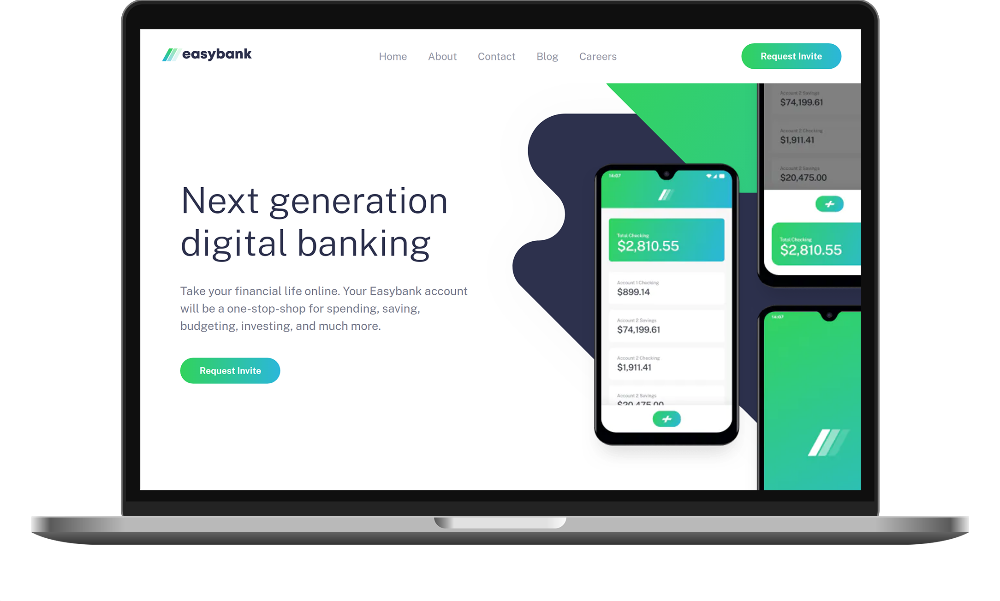
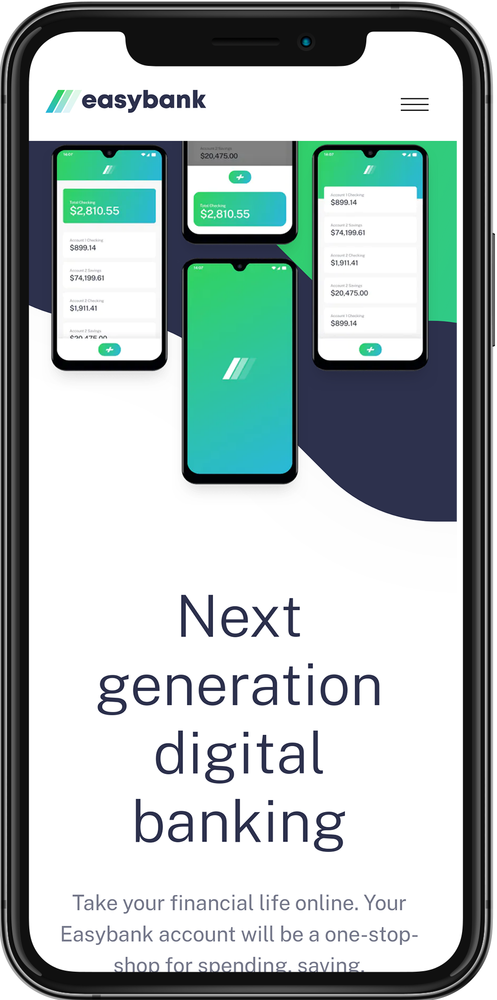

  
  <h1 align="center">Easybank</h1>
  
Landing page

  
  
  
  
   
  
   
  
  

  <a href="#bulb-motivation">Motivation</a>&nbsp;&nbsp;&nbsp;|&nbsp;&nbsp;&nbsp;
  <a href="#rocket-features">Features</a>&nbsp;&nbsp;&nbsp;|&nbsp;&nbsp;&nbsp;
  <a href="#gear-technologies">Technologies</a>&nbsp;&nbsp;&nbsp;|&nbsp;&nbsp;&nbsp;
  <a href="#computer-how-to-use">How to use</a>&nbsp;&nbsp;&nbsp;|&nbsp;&nbsp;&nbsp;
  <a href="#newspaper_roll-license">License</a>

---

&nbsp;&nbsp;&nbsp;

## :bulb: Motivation

My inspiration to build this project came from the [Easybank Landing Page Challenge](https://www.frontendmentor.io/challenges/easybank-landing-page-WaUhkoDN), on [Frontend Mentor](https://www.frontendmentor.io/challenges). Having only the proposed designs available, my goal was to build this landing page from scratch, making it fully interactive and responsive.

It was quite fun to refresh many CSS and layout implementation skills! :rocket:

## :zap: Features

- Fully responsive layouts, both mobile and desktop friendly.
- Collapsible navbar on small screens.

## :gear: Technologies

- [TypeScript](https://www.typescriptlang.org/)
- [React](https://reactjs.org/)
- [Styled Components](https://styled-components.com/)

> Deployed on [Vercel](https://vercel.com/home)

## :computer: How to use

Check out this project at [easybankapp.vercel.app](https://easybankapp.vercel.app/)!

## :newspaper_roll: License

This project is under MIT license. Check [LICENSE](./LICENSE) for more information.

---

Made by with :heart: by [Diego Aquino](https://github.com/diego-aquino). [Let's connect!](https://www.linkedin.com/in/diego-aquino)
